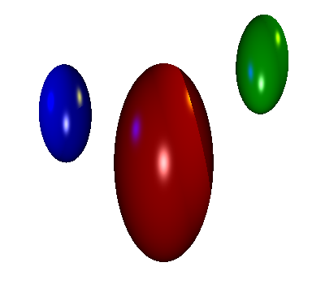

Raytracer
===================
    UCLA CS 174A Assignment 3
    Winter 2016

    Alan Kha            904030522   akhahaha@gmail.com
-------------------------------------------------------------------------------
Overview
---------------
Implement a ray-tracing graphics engine that can render spheres and lights with
local illuminations, reflections, and shadows to a PPM file.

Usage
---------------
    ./Raytracer.exe [inputFile]

Input File Example
---------------
    NEAR 1
    LEFT -1
    RIGHT 1
    BOTTOM -1
    TOP 1
    RES 600 600
    SPHERE s1 0 0 -10 2 4 2 0.5 0 0 1 1 0.9 0 50
    SPHERE s2 4 4 -10 1 2 1 0 0.5 0 1 1 0.9 0 50
    SPHERE s3 -4 2 -10 1 2 1 0 0 0.5 1 1 0.9 0 50
    LIGHT l1 0 0 0 0.9 0.9 0.9
    LIGHT l2 10 10 -10 0.9 0.9 0
    LIGHT l3 -10 5 -5 0 0 0.9
    BACK 1 1 1
    AMBIENT 0.2 0.2 0.2
    OUTPUT sample.ppm
    

Notes
---------------
All tests believed to be passed with the exception of image plane intersection tests, which cannot be confirmed.
